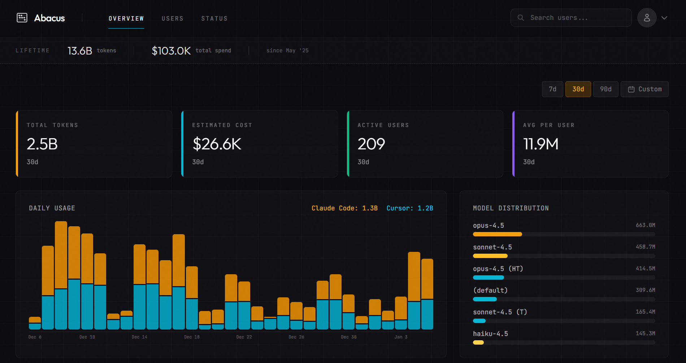

import { Card, CardGrid } from '@astrojs/starlight/components';

Track and analyze AI coding tool usage across your team. Supports Claude Code, Cursor, GitHub Commits, and more.

## Features

<CardGrid stagger>
  <Card title="Dashboard" icon="laptop">
    Token consumption, costs, model breakdown, and top users at a glance.
  </Card>
  <Card title="User Analytics" icon="setting">
    Per-user usage history, model preferences, and trend analysis.
  </Card>
  <Card title="Pivot Table" icon="list-format">
    Sortable, filterable view of all users with detailed metrics.
  </Card>
  <Card title="Multi-Provider" icon="puzzle">
    Mix and match Claude Code, Cursor, GitHub commits, or add your own.
  </Card>
  <Card title="Automated Sync" icon="rocket">
    Cron jobs for continuous data fetching from all providers.
  </Card>
  <Card title="CSV Import" icon="document">
    Manual import when APIs are unavailable or for historical backfills.
  </Card>
</CardGrid>

## Supported Providers

| Provider | Data Source | Features |
|----------|-------------|----------|
| **Claude Code** | Anthropic Admin API | Token usage, costs, model breakdown, API key mapping |
| **Cursor** | Cursor Admin API or CSV | Token usage, costs, model breakdown |
| **GitHub Commits** | GitHub App webhook + API | AI-attributed commit tracking (Co-Authored-By detection) |

Each provider is optional—configure only the ones you use.

## Get Started

Ready to set up Trackr? Check out the [Quick Start guide](/trackr/getting-started/quick-start/).
